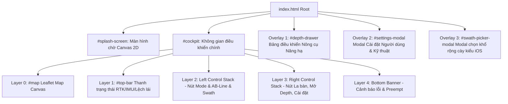

# TractorUI - Page Structure Specification

Tài liệu này mô tả chi tiết toàn bộ cấu trúc giao diện, cây DOM, các màn hình hiển thị (Screens/Modals/Drawers) và cơ chế hiển thị/ẩn trong `TractorUI/index.html`.

---

## 1. Cấu trúc Tổng thể & Phân lớp Màn hình

TractorUI là một **Single-Page Application (SPA)** được tổ chức theo mô hình phân lớp giao diện (Layered HUD/Cockpit) trên một file HTML duy nhất:

---

## 2. Chi tiết từng Màn hình / Modal

### 2.1. Màn hình Chờ (Splash Screen)
* **DOM ID**: `#splash-screen` (`index.html#L38-L58`)
* **Kiểu hiển thị**: Lớp phủ toàn màn hình (`position: fixed; inset: 0; z-index: 9999; background: #0b0f19;`).
* **Thành phần**:
  * Canvas 2D vẽ đồ hoạ vector hoạt hoạ máy kéo đang quay đầu và bám đường cày (`#splash-canvas`).
  * Logo và Tên thương hiệu: "SMART TRACTOR HMI".
  * Thanh tiến trình nạp (Loading bar) và văn bản trạng thái: "Connecting to Vehicle Telemetry Gateway...".
* **Hành vi ẩn/hiện**:
  * Hiện mặc định khi mở trang web.
  * Tự động ẩn bằng class CSS `.hidden` (opacity: 0; pointer-events: none) khi sự kiện WebSocket `ros.on('connection')` được kích hoạt (`index.html#L3380`).

---

### 2.2. Buồng lái Điều khiển Chính (Main Cockpit)
* **DOM ID**: `#cockpit` (`index.html#L60-L320`)
* **Chức năng**: Màn hình làm việc chính của tài xế máy kéo khi đang vận hành ngoài ruộng.

#### A. Bản đồ Nền (Map Canvas Layer)
* **DOM ID**: `#map` (`index.html#L61`)
* **Công nghệ**: Leaflet.js v1.9.4.
* **Các lớp đối tượng render liên tục**:
  * **Marker Máy kéo**: Icon máy kéo SVG tuỳ biến, tự xoay theo góc `heading` nhận từ IMU/GNSS.
  * **Marker Trạm Base**: Vị trí trạm GNSS tham chiếu (nếu có toạ độ).
  * **Đường vệt xe đã đi (Breadcrumb Trail)**: Polyline màu xanh nhạt lưu lại các điểm đã đi qua.
  * **Đường tham chiếu AB-Line**: Đường polyline kéo dài vô hạn khi dẫn đường kích hoạt.
  * **Lộ trình cày ruộng (Field Path)**: Polyline đa giác thể hiện toàn bộ luống cày được nạp từ planner.

#### B. Thanh Trạng thái Đỉnh Đầu (Top Status Bar)
* **DOM ID**: `#top-bar` (`index.html#L64-L140`)
* **Chứa các khối thông số giám sát tức thời (HUD Tiles)**:
  * **Trạng thái GNSS RTK**: Badge hiển thị Fix Type (`FIX`, `FLOAT`, `SINGLE`, `NONE`), số lượng vệ tinh (Sats), độ lệch chuẩn vị trí.
  * **Tốc độ di chuyển (Ground Speed)**: Đơn vị km/h, trích xuất từ `/fix_velocity`.
  * **Góc lái thực tế (Actual Steering Angle)**: Hiển thị độ (°) và thước đo đồ hoạ lệch tâm.
  * **Độ lệch tim đường (Cross-Track Error - CTE)**: Sai số cm giữa vị trí máy kéo và tâm luống cày.
  * **Góc nghiêng thân xe (Roll / Pitch)**: Cảnh báo chống lật máy kéo trên bờ ruộng dốc.
  * **Đèn báo trạng thái kết nối ROS (Status Dot)**: Xanh lá (Connected), Đỏ (Disconnected).

#### C. Cụm Điều khiển Bên Trái (Left Floating Control Stack)
* **DOM ID**: `.left-controls` (`index.html#L145-L210`)
* **Nút chuyển đổi Chế độ (`#mode-switch-btn`)**: Đổi giữa "AB-Line" và "Field Path".
* **Nút Ghi nhận Đường AB (`#record-line-btn`)**: Nút tròn lớn, đổi màu theo 3 trạng thái IDLE / RECORDING / ACTIVE.
* **Cụm dịch luống (Swath Nudge Steppers)**:
  * Nút "Shift Left" (Dịch sang trái 5cm/10cm).
  * Nút "Reset Shift" (Về tâm).
  * Nút "Shift Right" (Dịch sang phải 5cm/10cm).
* **Cụm nút Chạy lộ trình (`#path-action-btns`)**: Nút Bắt đầu / Tạm dừng theo đường cày ruộng.

#### D. Cụm Điều khiển Bên Phải (Right Floating Control Stack)
* **DOM ID**: `.right-controls` (`index.html#L215-L260`)
* **Nút La bàn / Xoay bản đồ (`#compass-btn`)**:
  * Hiển thị kim la bàn xoay theo hướng thực tế.
  * Nhấn vào để toggle giữa chế độ: **North-Up** (Bản đồ cố định hướng Bắc) và **Head-Up** (Bản đồ tự xoay theo mũi xe).
* **Nút Mở Bảng Nông cụ (`#open-depth-btn`)**: Nút mở Drawer điều khiển nâng hạ.
* **Nút Cài đặt Hệ thống (`#open-settings-btn`)**: Mở Modal thiết lập.

---

### 2.3. Bảng Điều khiển Nông Cụ (Implement Depth Drawer)
* **DOM ID**: `#depth-drawer` (`index.html#L265-L380`)
* **Kiểu hiển thị**: Drawer trượt từ cạnh phải hoặc dạng Modal Overlay chuyên dụng.
* **Chức năng**: Điều khiển van thuỷ lực nâng/hạ lưỡi cày/dàn xới phía sau đuôi máy kéo.
* **Thành phần giao diện**:
  * **Thước đo trực quan (Depth Visualizer Gauge)**: Thanh đo độ sâu đồ hoạ hiển thị vị trí thực tế của lưỡi cày so với mặt đất.
  * **Bộ chọn Chế độ**:
    * Tab `AUTO`: Cài đặt độ sâu mong muốn (50mm - 150mm) bằng thanh Slider.
    * Tab `MANUAL`: Cài đặt góc nâng ben thuỷ lực (0° - 35°).
    * Tab `HOME`: Nhấc bổng nông cụ lên cao an toàn để quay đầu xe.
  * **Nút Giữ để Kích hoạt (Hold-to-Confirm Button)**:
    * Chạm 1 lần để BẬT.
    * Nhấn và giữ đè đủ 1.0 giây để TẮT (Ngăn ngừa bấm nhầm khi xe dằn xóc).
  * **Cảnh báo chiếm quyền Cabin (`#depth-preempt-notice`)**: Banner nhấp nháy đỏ khi tài xế tác động vào cần gạt cơ khí trong cabin.

---

### 2.4. Modal Cài đặt Hệ thống (Settings Modal)
* **DOM ID**: `#settings-modal` (`index.html#L385-L650`)
* **Chức năng**: Cấu hình thông số vận hành và chẩn đoán kỹ thuật.
* **Được chia thành 2 Tab chính**:

#### Tab 1: Cài đặt Người dùng (Operator Settings)
* Cấu hình khổ rộng dàn cày (Implement Width / Swath) qua giao diện cuộn bánh xe kiểu iOS (`#swath-picker-modal`).
* Cấu hình khoảng cách cảnh báo lệch đường.
* Bật/tắt giọng nói hướng dẫn tiếng Việt (TTS Guidance).
* Bộ giả lập toạ độ GPS ảo dùng khi chạy thử nghiệm trong phòng lab không có vệ tinh.

#### Tab 2: Chuyên gia / Kỹ thuật viên (Engineer Diagnostics)
* **Khóa bảo vệ mật khẩu**: Phải nhập đúng mã PIN mới được truy cập các tab sâu hơn (`unlockEngineer()`).
* **Cấu hình WebSocket**: Đổi IP/Port của rosbridge server.
* **Bộ khám phá tham số ROS (Parameter Explorer)**:
  * Liệt kê danh sách tất cả các node ROS 2 đang chạy.
  * Đọc giá trị tham số (PID, Lookahead distance, Max steering rate,...).
  * Ghi đè tham số trực tiếp xuống ROS 2 runtime.
* **Công cụ Dò giới hạn Lái (Steering Limit Calibration Wizard)**:
  * Các nút Jog động cơ lái trái/phải từng bước nhỏ.
  * Nút lấy điểm Giữa, Giới hạn Trái, Giới hạn Phải.
* **Biểu đồ Dao động Lái thời gian thực (Live Telemetry Chart)**:
  * Tích hợp Chart.js hiển thị đồ thị so sánh giữa **Target Steering Angle** và **Actual Steering Angle**.
* **Trình soi Topic (Raw Topic Monitor / Explorer)**:
  * Cho phép chọn bất kỳ topic nào trong hệ thống và echo dữ liệu JSON thời gian thực lên màn hình để chẩn đoán sự cố đường truyền.
