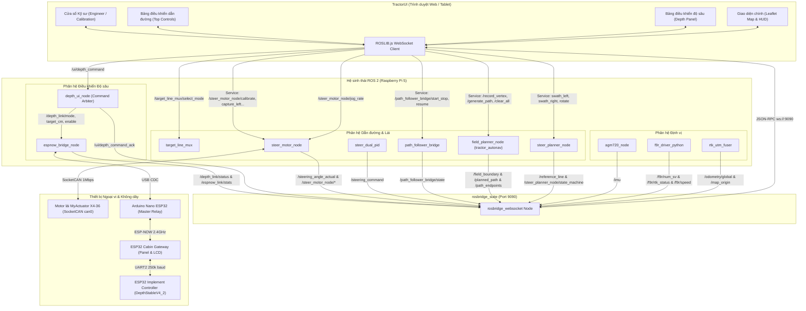

# TractorUI - Kiến trúc Tổng thể & Luồng Dữ liệu (UI Architecture)

Tài liệu mô tả kiến trúc phân lớp, luồng dữ liệu hai chiều giữa `TractorUI` và các hệ thống con ROS 2 trên máy tính nhúng Raspberry Pi 5.

---

## 1. Sơ đồ Kiến trúc Luồng Dữ liệu (Mermaid)

---

## 2. Chi tiết các luồng dữ liệu

### 2.1 Luồng Hiển thị Bản đồ & Telemetry Xe
1. Node [`rtk_utm_fuser`](file:///home/long/agent_tractor/tracktor_ws/src/tractor_localization/tractor_localization/rtk_utm_fuser.py) phát độ dịch chuyển thực tế của máy kéo lên `/odometry/global` và tọa độ gốc Datum lên `/map_origin`.
2. Trình duyệt nhận tin tại hàm callback `subscribeToTopic('/odometry/global')`:
   - Tính toán chuyển đổi từ tọa độ Odometry địa phương sang vĩ độ/kinh độ GPS toàn cầu dựa vào tọa độ mốc `mapOriginLat/Lon` (nguồn: `index.html` dòng 4410-4494).
   - Chuyển Quaternion sang góc Euler Yaw của xe (`tractorMathYaw`).
   - Cập nhật vị trí Marker biểu tượng máy kéo trên bản đồ Leaflet.
   - Ghi lại các điểm đã đi qua thành vệt bánh xe màu xanh (swath breadcrumbs `trailLayer`).

### 2.2 Luồng Dẫn đường AB-Line (Record Line Pipeline)
1. Người dùng chọn chế độ bám đường thẳng (`currentControlMode = 'record'`). UI gửi lệnh chọn chế độ mux: `/target_line_mux/select_mode = 1` (`index.html` dòng 2050).
2. Khi người dùng nhấn giữ nút **Record Line** (500 ms), UI gọi service `/steer_planner_node/toggle_line_recording`.
3. Node [`steer_planner_node`](file:///home/long/agent_tractor/tracktor_ws/src/tractor_steer_controller/src/steer_planner_node.cpp) phát trạng thái máy FSM về `/steer_planner_node/state_machine`. UI tự động đổi màu nút sang vàng (Đang ghi) rồi xanh lá (Đang bám tự động).
4. Đường tham chiếu được nhận qua topic `/reference_line` (`nav_msgs/Path`), được UI vẽ đè lên bản đồ vệ tinh (`referencePathLayer`) và đồng bộ góc xoay bản đồ (`P-UP` mode).

### 2.3 Luồng Tạo lộ trình ruộng tự động (Field Path Pipeline)
1. Người dùng chọn chế độ tạo lộ trình (`currentControlMode = 'path'`). UI gửi lệnh mux: `/target_line_mux/select_mode = 2` (`index.html` dòng 2060).
2. Người dùng nhấn giữ các nút:
   - **Thêm đỉnh ranh giới**: gọi service `/record_vertex`.
   - **Tạo đường cày (Generate Path)**: gọi service `/generate_path`.
   - **Xóa toàn bộ (Clear All)**: gọi service `/clear_all`.
3. UI lắng nghe các topic trực quan hóa từ `tractor_autonav`:
   - `/field_boundary` (`geometry_msgs/PolygonStamped`): Đường viền thửa ruộng màu xanh ngọc.
   - `/planned_path` (`nav_msgs/Path`): Lộ trình cày ngoằn ngoèo phủ kín lòng ruộng.
   - `/path_endpoints` (`visualization_msgs/MarkerArray`): Đánh dấu vị trí đầu luống/cuối luống.
4. Điều khiển bám lộ trình: Nút **Start / Stop** gọi service `/path_follower_bridge/start_stop` (hoặc `/path_follower_bridge/resume` nếu đang tạm dừng).

### 2.4 Luồng Điều khiển Độ sâu Dàn cày (Implement Depth Pipeline)
1. Người vận hành lựa chọn chế độ trên Depth Panel:
   - `AUTO` (Mode 0): Đặt chiều sâu mục tiêu (50 - 150 mm).
   - `MANUAL` (Mode 1): Đặt góc tay nâng mục tiêu (0 - 35°).
   - `HOME` (Mode 2): Nhấc toàn bộ dàn cày lên vị trí di chuyển an toàn.
2. Để tránh vô tình thay đổi độ sâu khi rung xóc, nút **ACTIVATE** bắt buộc phải **nhấn giữ 1000 ms** để nhả/ngắt (Deactivate), hoặc ấn 1 chạm để kích hoạt.
3. Lệnh được publish vào `/ui/depth_command` (`tractor_espnow_bridge/msg/DepthUiCommand`) với cờ `enable` (`index.html` dòng 3897-3906).
4. Node `depth_ui_node` điều phối gửi tuần tự các topic `/depth_link/mode`, `/depth_link/target_cm`, `/depth_link/enable` tới `espnow_bridge_node`.
5. Phản hồi thời gian thực từ dàn cày (độ sâu thực tế, góc tay nâng, góc đuôi cày, cờ mất kết nối, cảnh báo chiếm quyền cabin) được trả về qua topic `/depth_link/status` và vẽ trực tiếp lên thanh đo `depth-gauge-actual`.
