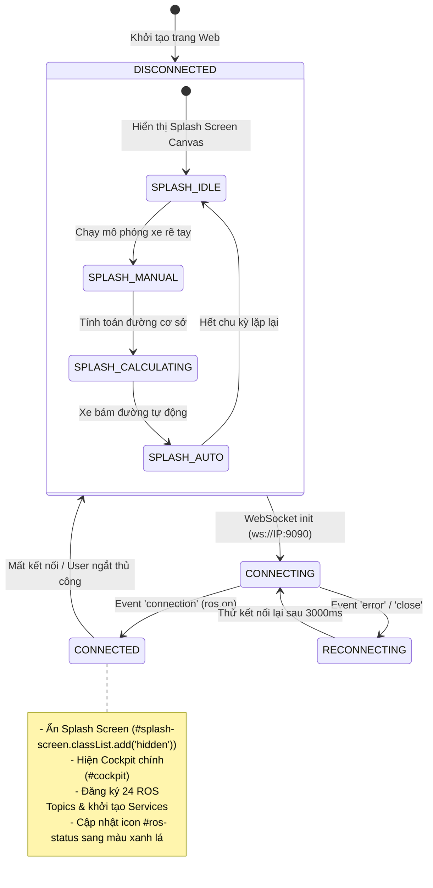
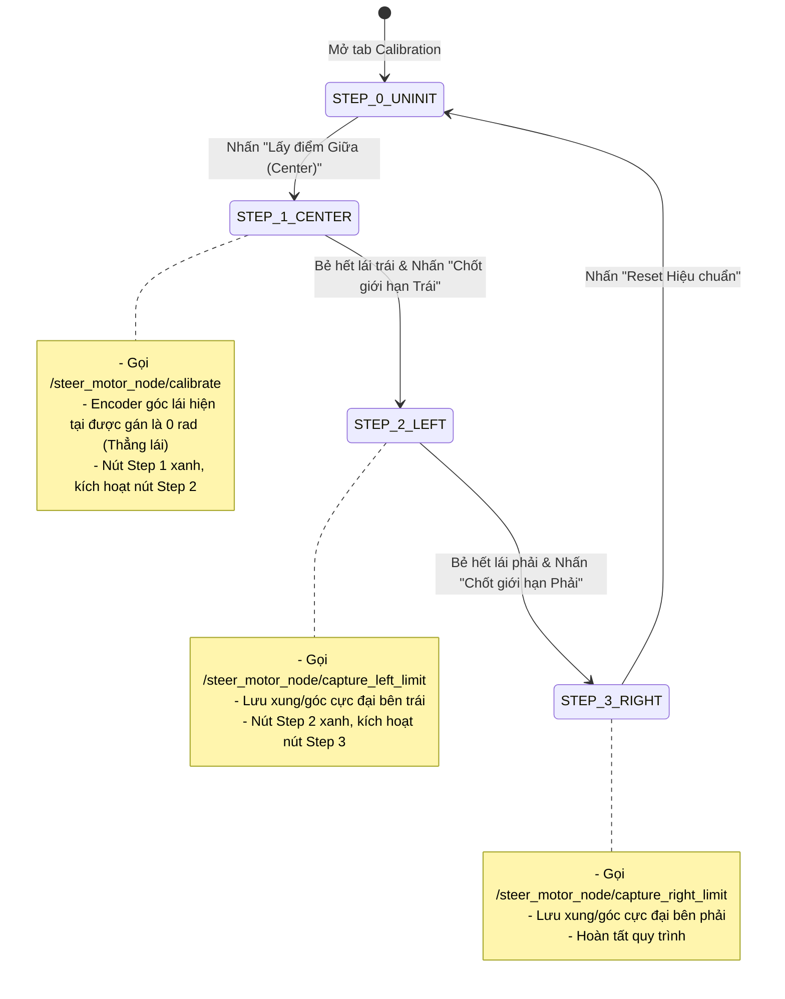
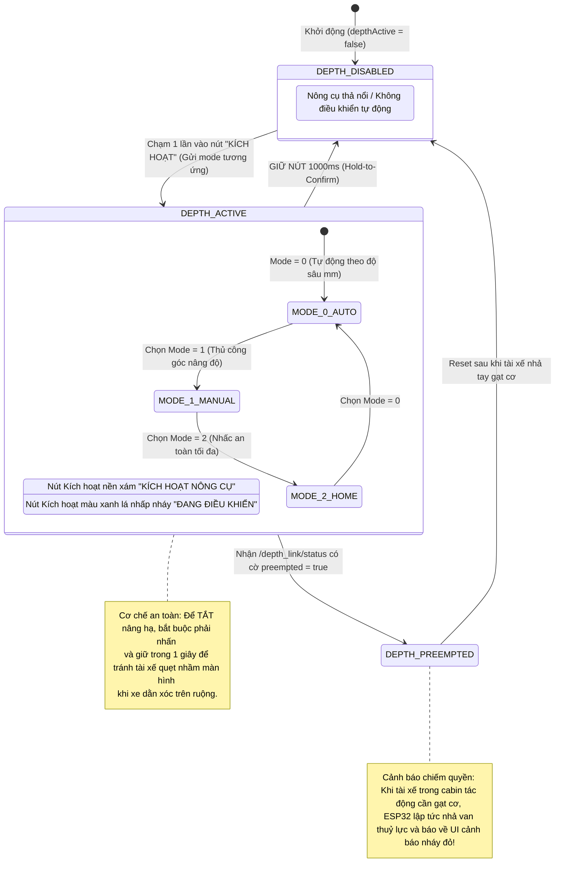

# TractorUI - Finite State Machines (FSM) Specification

Tài liệu này đặc tả toàn bộ các máy trạng thái hữu hạn (FSM) đang điều khiển luồng hoạt động của giao diện TractorUI (`index.html`). Mọi biểu đồ và quy tắc chuyển trạng thái đều được trích xuất trực tiếp từ logic code JavaScript thực tế.

---

## 1. Tổng quan các FSM trong Hệ thống

Hệ thống TractorUI bao gồm 5 máy trạng thái cốt lõi hoạt động song song hoặc lồng ghép:
1. **WebSocket Connection & Splash Screen FSM**: Quản lý vòng đời kết nối với ROSBridge và màn hình chờ mô phỏng Canvas 2D.
2. **Guidance Mode & Target Line Mux FSM**: Quản lý việc chuyển đổi giữa chế độ dẫn đường AB-Line và Lộ trình đường cày (Field Path).
3. **AB-Line Guidance Planner FSM**: Đồng bộ trạng thái ghi nhận đường thẳng tham chiếu với `/steer_planner_node/state_machine`.
4. **Field Path Follower FSM**: Điều khiển chu trình nạp lộ trình, bắt đầu, tạm dừng và khôi phục bám đường cày với `/path_follower_bridge/state`.
5. **Steering Motor Calibration Wizard FSM**: Quy trình từng bước hiệu chuẩn giới hạn cơ khí động cơ lái qua ROS services.
6. **Implement Depth Controller FSM**: Quản lý trạng thái nông/sâu, kích hoạt an toàn (Hold-to-Confirm) và cảnh báo chiếm quyền cabin.

---

## 2. WebSocket Connection & Splash FSM

Quản lý màn hình Splash lúc khởi động (`#splash-screen`) và trạng thái kết nối WebSocket tới rosbridge (`index.html` dòng 3244 - 3390, 4830 - 4890).



### Các chuyển trạng thái trong Code:
* **Khởi tạo kết nối**: Hàm `connectROS()` (`index.html#L3370`).
* **Sự kiện `ros.on('connection')`**: Đặt `isConnected = true`, đổi icon trạng thái, ẩn splash:
  ```javascript
  // index.html#L3374-3382
  statusDot.className = 'status-dot connected';
  statusText.textContent = 'Connected';
  document.getElementById('splash-screen').classList.add('hidden');
  initRosSubscribers();
  ```
* **Sự kiện `ros.on('error')` / `ros.on('close')`**: Đặt `isConnected = false`, icon chuyển đỏ, lên lịch retry sau 3000ms.

---

## 3. Guidance Mode & Target Line Mux FSM

Người vận hành chọn giữa **Ghi đường thẳng AB-Line** hoặc **Chạy lộ trình cày Field Path** (`index.html#L3800 - 3840`).

```mermaid
stateDiagram-v2
    [*] --> MODE_AB_LINE: Mặc định khởi động (currentControlMode = 'record')

    MODE_AB_LINE --> MODE_FIELD_PATH: Nhấn nút "Chạy lộ trình" (Khi Planner State == IDLE)
    MODE_FIELD_PATH --> MODE_AB_LINE: Nhấn nút "Ghi đường AB" (Khi Planner State == IDLE)

    state MODE_AB_LINE {
        [*] --> AB_IDLE
        note right of MODE_AB_LINE
            - Gửi /target_line_mux/select_mode = 1 (StdMsgsInt32)
            - Hiển thị nút Ghi đường (#record-line-btn)
            - Ẩn cụm nút Path Follower (#path-action-btns)
        end note
    }

    state MODE_FIELD_PATH {
        [*] --> PATH_IDLE
        note right of MODE_FIELD_PATH
            - Gửi /target_line_mux/select_mode = 2 (StdMsgsInt32)
            - Hiển thị cụm nút Path Follower (#path-action-btns)
            - Ẩn nút Ghi đường AB
        end note
    }

    note right of [*]
        Khóa an toàn: Chỉ cho phép chuyển Mode khi 
        plannerState === 1 (IDLE). Nếu đang RECORDING hoặc ACTIVE, 
        nút chuyển chế độ bị vô hiệu hóa hoặc chặn chuyển đổi.
    end note
```

---

## 4. AB-Line Guidance Planner FSM

Đồng bộ giữa UI và Node ROS 2 `/steer_planner_node` qua topic `/steer_planner_node/state_machine` (`index.html#L3770 - 3830`).

```mermaid
stateDiagram-v2
    [*] --> STATE_1_IDLE: Nhận state_machine = 1

    STATE_1_IDLE --> STATE_2_RECORDING: Nhấn nút "Bắt đầu ghi đường" / Dịch chuyển A-B
    STATE_2_RECORDING --> STATE_3_ACTIVE: Thu đủ 2 điểm A & B / Node xác nhận
    STATE_3_ACTIVE --> STATE_1_IDLE: Nhấn nút "Dừng / Hủy dẫn đường"

    state STATE_1_IDLE {
        description: Trạng thái chờ / Thủ công
        UI_Style: Nút Record Line màu xám/xanh dương "Ghi đường thẳng"
        Trail: Xóa vệt đường quá khứ
        TargetLine: Ẩn đường tham chiếu
    }

    state STATE_2_RECORDING {
        description: Đang ghi nhận đường cơ sở (A -> B)
        UI_Style: Nút nhấp nháy vàng "Đang ghi nhận..."
        TTS: Phát giọng nói "Bắt đầu ghi đường"
    }

    state STATE_3_ACTIVE {
        description: Tự động lái bám đường thẳng đang hoạt động
        UI_Style: Nút chuyển màu xanh lá rực rỡ "Tự động kích hoạt"
        TargetLine: Vẽ đường chuẩn nối dài vô hạn trên Leaflet
        TTS: Phát giọng nói "Bắt đầu tự động lái"
    }
```

* **Trạng thái 1 (IDLE)**: Xóa trail, tắt line tham chiếu (`clearTargetLine()`, `clearVehicleTrail()`).
* **Trạng thái 2 (RECORDING)**: Cập nhật giao diện ghi toạ độ A-B.
* **Trạng thái 3 (ACTIVE)**: Đường AB được vẽ nối dài vô hạn theo heading, phát âm thanh TTS tiếng Việt qua Web Speech API.

---

## 5. Field Path Follower FSM

Điều khiển việc bám theo đường quy hoạch diện tích cày mẫu lớn qua topic `/path_follower_bridge/state` (`index.html#L4160 - 4250`).

```mermaid
stateDiagram-v2
    [*] --> PATH_UNLOADED: Chưa có lộ trình (/field_path rỗng)

    PATH_UNLOADED --> PATH_LOADED: Nhận mảng toạ độ từ /field_path

    state PATH_LOADED {
        [*] --> BRIDGE_STATE_3_STOPPED: bridge_state = 3 (Đang dừng)
        
        BRIDGE_STATE_3_STOPPED --> BRIDGE_STATE_4_RUNNING: Nhấn "Bắt đầu" (Gửi start_stop: true hoặc resume)
        BRIDGE_STATE_4_RUNNING --> BRIDGE_STATE_3_STOPPED: Nhấn "Tạm dừng" (Gửi start_stop: false)

        BRIDGE_STATE_4_RUNNING --> BRIDGE_STATE_5_ERROR_FAR: Máy kéo cách quá xa điểm bắt đầu (> Max deviation)
        BRIDGE_STATE_5_ERROR_FAR --> BRIDGE_STATE_3_STOPPED: Đưa xe lại gần & nhấn Reset
    }

    state BRIDGE_STATE_3_STOPPED {
        Nút_UI: Nút màu xanh lá "Bắt đầu theo đường"
        Action: Gọi service /path_follower_bridge/resume hoặc start_stop=true
    }

    state BRIDGE_STATE_4_RUNNING {
        Nút_UI: Nút màu cam/đỏ "Tạm dừng"
        Action: Gọi service /path_follower_bridge/start_stop data=false
    }

    state BRIDGE_STATE_5_ERROR_FAR {
        Nút_UI: Báo lỗi đỏ
        Action: Cảnh báo Modal: "Vị trí máy kéo quá xa vạch xuất phát!"
    }
```

---

## 6. Steering Motor Calibration Wizard FSM

Quy trình hiệu chuẩn góc lái 4 bước được tích hợp trong Modal Cài đặt Kỹ thuật viên (`index.html#L4420 - 4530`).



---

## 7. Implement Depth Controller FSM

Điều khiển cơ cấu nâng hạ nông sâu nông cụ ở đuôi máy kéo (`index.html#L3880 - 4020`).


